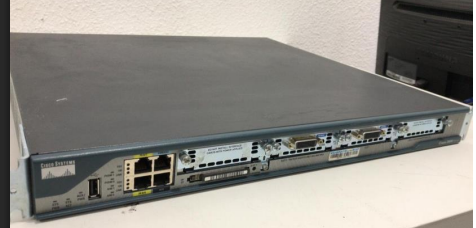
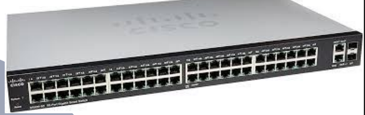
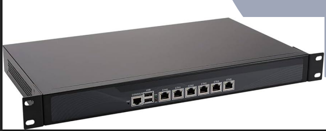
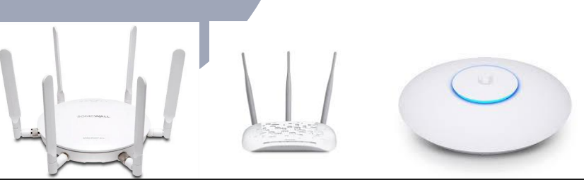

# Introdução

## O que é uma rede de computadores?
- Cabo azul, não ironicamente.
- Sala cofre, onde fica o servidor, roteador
- Comunicação entre uma ou mais máquinas que estão ligadas via cabo ou não, e a partir disso temos uma comunicação via IP
- Comunicação de 2 ou mais computadores utilizando um protocolo comum, IP

TCP, *transmission control protocol*

Tudo que estiver conectado na mesma rede, no mesmo protocolo, lâmpada, celular, computador, ar-condicionado

Toda comunicação é feita pelo IP (*Internet Protocol*)

É um conjunto de duas ou mais máquinas interligadas entre si na mesma rede tendo em comum o IP.
Permitindo usuários compartilharem recursos, como arquivos, impressoras e acesso à internet

## Importância das redes de computadores
Importante para manter as conexões entre as máquinas

## Tipos de redes de computadores
Com fio e sem fio

## Faz parte da infraestrutura de TI?
Faz parte sim

### Conceito de rede
Uma rede de computador interligados entre si pelo IP
Permite que usuários compartilhem recursos como arquivos, impressoras, etc

##### Nó na rede
Qualquer equipamento que esteja vinculado na rede, presente na rede
Nó = um ponto de acesso.

A rede de computador é uma malha que interliga milhares de sistemas computacionais para a transmissão de dados. Também conhecido como **nós**.

Computador, servidor, celular, modem, lâmpada inteligente, ar-condicionado, impressora, são todos exemplos de **nós**.
##### Servidor
É um computador ligado a uma rede e vai fornecer coisas, recursos para podermos acessar, com uma capacidade maior que um computador normal
- servidor de arquivo
	- google cloud
	- dropbox
	- google drive
### Para que serve uma rede?
A rede ela quebra barreiras geográficas e possibilita que informações sejam compartilhadas entre pessoas e empresas do mundo inteiro.

Aplicações como enviar e receber e-mails, assistir vídeo, receber áudio pelo celular só são possíveis através de uma rede.

### Como é formada uma rede?
Uma rede de computadores é formada por um conjunto de computadores autônomos conectados por uma tecnologia, capazes de trocar informações e compartilhar recursos, interligados por um sistema de comunicação.

Cada nó da rede, tem e cumpre seu papel

Todas as operações são monitoradas.
##### Protocolos permitidos na rede:
Administrador de rede, vai monitorar, analisar, e verificar. Vai escrever e determinar quais regras aplicadas.
### Host:
Qualquer equipamento ligado a rede.
#### Topologia de uma rede: 
Como ela foi concebida, como ela funciona, se é ligado em anel, ligado em série, formato estrela.

## Arquitetura de redes
- Modelo OSI - 7 camadas
- Modelo TCP/IP - 4 camadas

**Roteadores** conectam diferentes redes entre si, possui processador, memória, SO:

**Switches** conectam vários dispositivos a uma mesma rede:

**Firewalls** protegem as redes contra acessos não autorizados

**Access** **Points** permitem que dispositivos se conectem a uma rede Wi-Fi:

