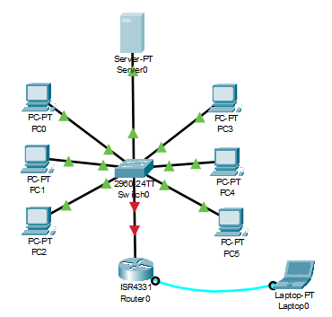
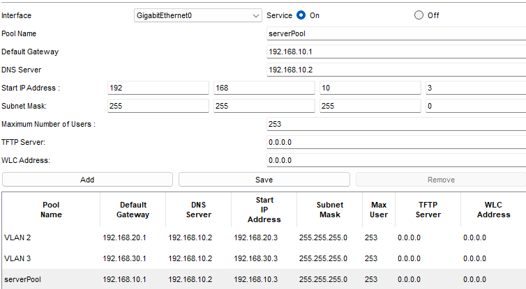
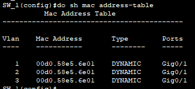
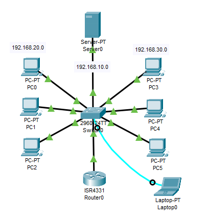

# VLAN (Virtual Local Area Network)

rede local virtual
toda vlan tem um numero e um nome

pq usar vlan?
- segmentar rede 
- organizar 
- separar ambiente de rede

vamos separar as entradas do switch 
FastEthernet 1-10 uma rede

FastEthernet 11-20 outra rede

"do show vlan brief"

proporciona uma melhor segurança e um melhor desempenho da rede
permite a separação lógica de dispositivos em uma rede física

vlan permite criar sub-redes virtuais dentro de uma rede física.

"vlan 2"

"name TI" nome da vlan

"interface range fa0/1-10" entra no range de 1 a 10

"switchport access vlan 2"

"exit"

"do wr"


# Revisão

#### Configuração da VLAN
VLAN é uma rede local virtual

Serve para:
- Segmentar
- Organizar
- Separar ambientes de rede

Toda VLAN tem um número e um nome

Para configurar as VLAN's, vamos criar uma rede básica, com 1 roteador, 1 switch, 1 servidor e 6 máquinas, 3 de cada lado, mais ou menos assim:



#### Servidor 

Agora vamos configurar o servidor

Coloque um IP estático nele

IP 192.168.10.2
Gateway 192.168.10.1 
DNS 192.168.10.2

Agora vamos configurar o DHCP

Vamos em Services -> DHCP

Primeiramente ligamos o DHCP

E agora vamos configurar as POOL's 

Configuramos a *serverPool* como a rede 192.168.10.0

Depois criamos a VLAN 2 como a rede 192.168.20.0

E por fim, criamos a VLAN 3 como a rede 192.168.30.0

Ficando assim, com as 3 POOL's


Se quiser configurar o DNS, pro servidor web funcionar, ok, mas nessa revisão não iremos fazer isso.

#### Switch

Agora vamos para a configuração do switch, coloque o cabo console no switch e vamos para a configuração.

Entre no modo de configuração global

E vamos criar as VLAN's, dar nome a elas e colocar elas no modo *TRUNK*

Primeiramente vamos criar uma VLAN, para se criar uma VLAN escrevemos

```Bash
vlan 2 # numero q eu desejo para minha VLAN
```

aí iremos entrar no modo de configuração da VLAN e iremos dar um nome a ela

```
name Vlan 1
```

Agora criamos outra VLAN:

```
vlan 3
```

E damos um nome para ela:

```
name Vlan 2
```

Agora entramos na gigabit

```
int gigabit0/1
```

Colocamos no modo *TRUNK*

```
sw mode trunk
```

E esse comando permite todas as VLANs passarem por essa interface *trunk*.

```
sw trunk allowed vlan all
```

Agora precisamos definir o range de cada sub-rede

Para isso dividimos de 1 a 10 a primeira rede

```
int range fa0/1-10
```

E demos acesso as entradas de 1 a 10 a VLAN 2.
Qualquer dispositivo conectado a uma dessas portas será da VLAN 2.

```
sw access vlan 2
```

E de 11 a 20 a segunda rede

```
int range fa0/11-20
```

E demos acesso as entradas de 11 a 20 para VLAN 3

```
sw access vlan 3
```

Se quisermos ver as VLAN's criadas, basta

```
do sh vlan brief
```

#### Roteador

Agora vamos configurar o roteador

Primeiramente devemos entrar na gigabit q está conectada ao switch e usar esse comando

```
int gigabit0/0/0
```

Se tiver algum IP atribuído, usamos esse comando para apagar o IP

```
no ip add
```

Para ligar o roteador:

```
no shut
```

Agora vamos criar as sub redes, para isso vamos acessar elas

0.1 é uma sub rede da interface 0
```
int gigabit0/0/0.1
```

Encapsulamos para dizer que essa subinterface vai tratar o tráfego de uma VLAN específica, no caso aqui VLAN 1

```
encapsulation dot1q 1
```

E atribuímos IP a essa rede

```
ip add 192.168.10.1 255.255.255.0
```

Depois colocamos um *helper-address* para redirecionar mensagens de uma rede a outra, para que o DHCP funcione em outra sub rede

```
ip helper-address 192.168.10.2
```

Configuramos a primeira sub rede, com IP 192.168.10.0, com o *helper-address* e encapsulamos ela para trafegar na VLAN 1

Faremos isso as outras duas redes

Entramos na segunda sub rede:

```
int gigabit0/0/0.2
```

Encapsulamos o tráfego para a VLAN 2

```
encapsulation dot1q 2
```

E adicionamos o IP na sub rede 2

```
ip add 192.168.20.1 255.255.255.0
```

E o helper-address para permitir que o DHCP funcione nessa sub rede

```
ip helper-address 192.168.10.2
```

E vamos para a ultima sub rede

```
int gigabit0/0/0.3
```

Encapsulamos o tráfego para a VLAN 3

```
encapsulation dot1q 3
```

Colocamos IP 

```
ip add 192.168.30.1 255.255.255.0
```

Adicionamos o helper-address

```
ip helper-address 192.168.10.2
```

E por fim salvamos as configurações

```
do wr
```

E pronto, configuramos as 3 sub redes

VLAN 1 - 192.168.10.0
VLAN 2 - 192.168.20.0
VLAN 3 - 192.168.30.0

Se quiser ver a tabela de endereços MAC use esse comando

```
do sh mac address-table
```



Aqui mostra as VLANS 1, 2 e 3 e seus respectivos endereços MAC, e todas estão na Gig0/1, pois estão passando pelo mesma porta física, o que indica que a porta Gig0/1 está em modo *trunk*.

No final devemos ter mais ou menos isso, com tudo funcionando


E para fazer o teste de pacotes, falta configurar o IP das máquinas, para isso basta ir em Desktop -> IP configuration

E colocar no modo DHCP, provável de primeira irá dar errado, tente novamente e dará certo, se continuar dando erro, pode ser erro no servidor ou na hr de configurar os IP's das sub redes.
