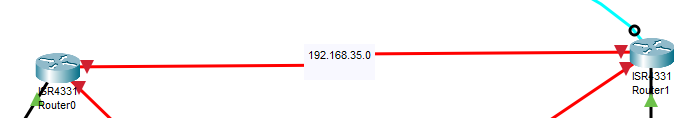
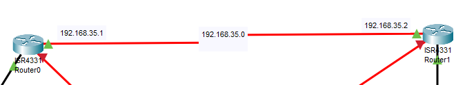
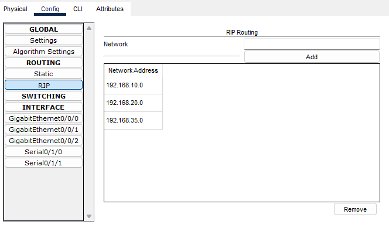

Conectar dois roteadores

configura os roteadores igual sempre, ip, normal

primeiro desliga o roteador e coloca a placa serial NM-2T

o segmento de um roteador para outro roteador é uma rede

na rede do meio a gente usa o .1 e .2

pega cabo DCE e conecta no roteador na porta serial 0/1/0 e no outro roteador tb

teste de pacote

"do pc1 p roteador 1"
"do pc1 p roteador 2"
"do pc1 p pc2"


# Revisão

Para conectarmos e configurarmos dois ou mais roteadores precisamos configurar o padrão: 
- IP no roteador;
- *banner, password e hostname* opcionais

E agora precisamos colocar uma placa serial no nosso roteador para fazer poder conectar eles entre si, para isso, clicamos no roteador desligamos ele e colocamos a placa serial **"NM-2T"** e depois ligamos o roteador de novo, msm jeito de colocar a Gigabit no servidor.

Com a porta serial no roteador pegamos o cabo serial vermelho **Serial DCE** e conectamos no roteador na porta **Serial0/1/0** e no outro roteador na porta **Serial0/1/0** 

Desse jeito:


Ao fazer isso você cria uma nova rede que conecta o *Router0* ao *Router1*, nesse caso criamos a rede 192.168.35.0

E agora precisamos configurar o IP dessa nova rede, para isso, devemos colocar o cabo console e ir em cada um dos roteadores e adicionar o IP na porta serial de cada um dos roteadores

Devemos fazer isso em cada um dos lados da nossa nova rede 192.168.35.0, no roteador da esquerda e no roteador da direita

Para isso usando o laptop entramos no terminal do roteador da esquerda entramos no modo de configuração global e usamos esse comando para ver as portas

```
do sh ip int brief
```

Lembrando que o cabo DCE é na porta serial

Usamos esse comando para entrar na interface da porta serial

```
int s/0/1/0 
```

E adicionamos o IP dessa nova rede

```
ip add 192.168.35.1 255.255.255.0
```

Depois para ligar a rede:

```
no shut
```

Fazendo isso a gente mexeu no roteador da esquerda e na teoria ligamos  a rede, mas para ligar ela de fato precisamos fazer dos dois lados a configuração do IP e usar o "no shut"

Com isso vamos para o roteador da direita e no terminal fazemos a msm coisa

Para entrar na interface da porta serial, antes confirme se está na porta 0/1/0 colocando o mouse por cima do fio e vendo ou usando esse comando 

```
do sh ip int brief
```

E para entrar na interface

```
int s/0/1/0 
```

Adicionar o IP da rede, lembrando que nessa rede intermediária que criamos, podemos usar qualquer IP nela, por isso estamos usando o .1 na esquerda e o .2 na direita, mas se quiser usar qualquer IP, é liberado

```
ip add 192.168.35.2 255.255.255.0
```

Para ligar a rede:

```
no shut
```

Com a configuração dos dois lados, temos na teoria essa rede intermediária de IP 192.168.35.0
Do lado esquerdo colocamos o .1 e no lado direito colocamos o .2 e ligamos os dois lados


Para fazermos o teste de pacotes, fazemos o teste de uma máquina para outra na mesma rede. Depois de uma máquina para o roteador na mesma rede, e depois de uma máquina para o roteador de outra rede. Nesse ponto vai dar *Failed* por que vc n configurou sua *RIP*.

Clique no seu roteador vá em config -> Routing -> RIP


E adiciona os IP's das suas redes, tanto as redes normais dos switches quanto a rede intermediária.
Faça isso nos dois roteadores conectados e faça o teste dos pacotes dnv.

Porém faça o teste de pacote nessa ordem.
- Máquina -> máquina
- Máquina -> roteador da msm rede
- Máquina -> roteador de outra rede

Se tu td der certo deu *Successful*.

E se quiser testar o *WebBrowser* na outra rede, vc deve colocar um IP estático na máquina da outra rede com o DNS da rede que o servidor está e deve funcionar normalmente.