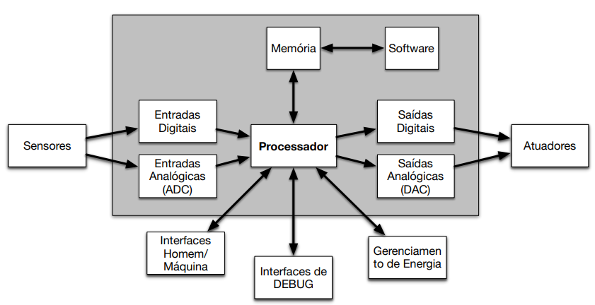

# O que são sistemas embarcados?

## Áreas de aplicação
- Aviação 
- Indústria Automotiva
- Telecomunicações
- Robótica
- Automação
- Eletrônicos
- Eletrodomésticos
- Outros...
## Definições

“Uma combinação de hardware e software, e frequentemente outras partes elétricas e/ou mecânicas, projetado para executar função específica. Em alguns casos, fazem parte de um produto ou sistema maior…” (Barr and Ganssle, 2003)

"Um sistema que, ao contrário dos sistemas de propósito geral, faz uma só coisa continuamente e que geralmente tem conexão com o mundo físico.” (Filipe Vinci, 2018)

### Classificação similares à Computadores de propósito geral
- Video games, tablets*, smartphones*

### Sistemas de controle
- Controle em malha fechada de sistemas em tempo real
- Controle de vôo, controle de combustão do motor, reator nuclear
- Controle de eletrodomésticos, automação residencial, etc.

### Processamento de sinais
- Decodificador de TV digital, radar, sonar

### Comunicação e redes
- Telefone celular*, Roteadores

## Características
- Aplicação bem definida e pré-definida (Contrária aos dispositivos de propósito geral)
- Restrições de tempo real
- Confiabilidade
- Eficiência energética
- Baixo Custo
- Restrições de memória

#### Hardware
- Elementos de processamento
- Periféricos
	- Dispositivos de I/O
	- Interfaces com sensores e atuadores
	- Interfaces de comunicação (protocolos)
- Memória
- Barramento

#### Software
- Sistema (OS, RTOS, Compilador)
- Aplicação

## Software embarcado

#### Requisitos
- Correção lógica
- Correção temporal
	- Algo correto no tempo errado não tem validade
- Tratar concorrência física (conexão com o mundo externo)
- Confiabilidade e tolerância a falhas são críticas
- Funcionalidade específica para um fim
- Multi-tarefa e concorrencia
	- Tratar de várias entradas e saídas e múltiplos eventos
	- A separa