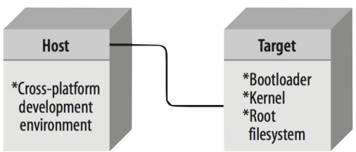
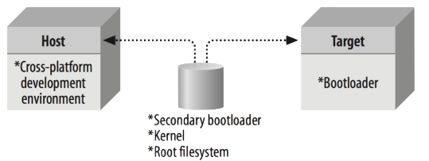
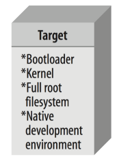

Desenvolvimento para sistemas embarcados

Conceito de cross-platform

Plataformas computacionais variam tanto em arquitetura de hardware quanto de software

arquitetura de software (so com seus drivers, bibliotecas etc) varia em cada plataforma

o desenvolvimento de sw deve considerar todas essas características

HOST (PC)
- linux
	- debian
	- fedora
	- openSuse

- Unix
	- solaris
	- opensolaris
- MACos
- Windows

Configurações Host/Target

- conexão
- midia removivel
- independente

formas de debug
- ST-link
- JTAG
- Ethernet

# Revisão

## Desenvolvimento para sistemas embarcados

- Conceito de *cross*-*platform* (capacidade de um software rodar em diferentes SO, arquiteturas ou dispositivos sem precisar ser totalmente reescrito)
- Componentes e suas funções (*host*, target*,* interface de comunicação, etc)
- Processo de geração de imagens
- Utilização de *makefiles*

### Host (PC)
- **Linux**
	- Debian
	- Fedora
	- OpenSusE
	- Ret Har
	- ETC
- **Unix**
	- Solaris
	- OpenSolaris
	- FreeBSD
	- OpenBSD
- **Mac OS X**
- **Windows**

### Configurações *Host/Target*

##### Conectado (*Linked Setup*)
- Cabo físico conectado (Serial, JTAG, Ethernet, USB) por onde trafega toda a comunicação
- É possível manter o sistema de arquivos do target montado no *host* (NFS)

Ex: Arduino/Esp32 que conectamos um cabo e fazemos a comunicação.

##### Media Removível (*Removable Storage Setup*)
- Não há conexão física entre os sistemas
- O *target* possui somente um *bootloader* mínimo permanente

Ex: RaspberryPi ela possui um cartão SD, que podemos remover, conectar no computador, compilar o que queremos, e depois colocamos de volta na RaspberryPi e ele faz o boot no cartão

##### Independente (*Standalone Setup*)
- Todo o ambiente de desenvolvimento está no target
- Similar a uma workstation mas tipicamente com menor poder computacional

### Configurações Host/Target - Debug

- Serial Link
- Ethernet 
- JTAG
